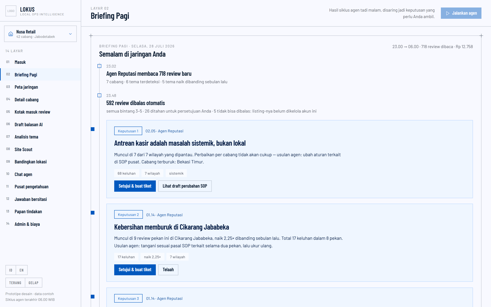
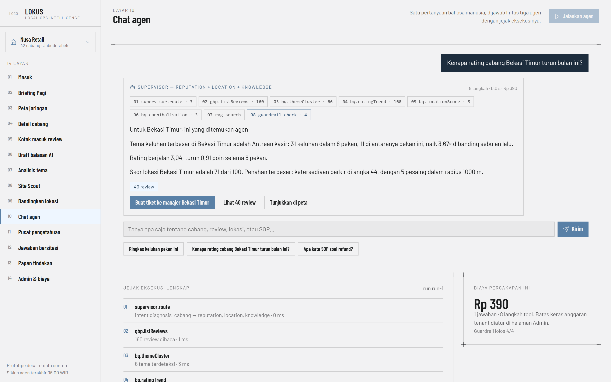
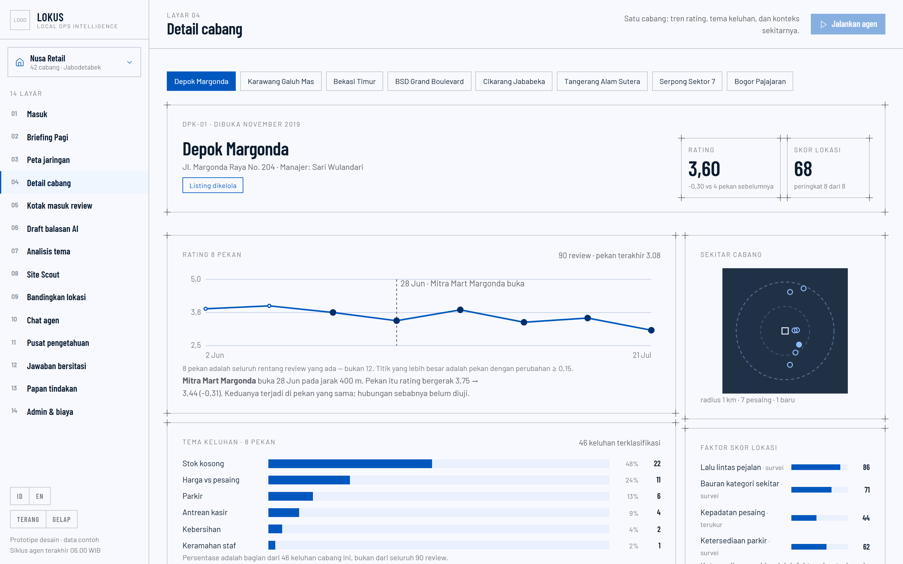
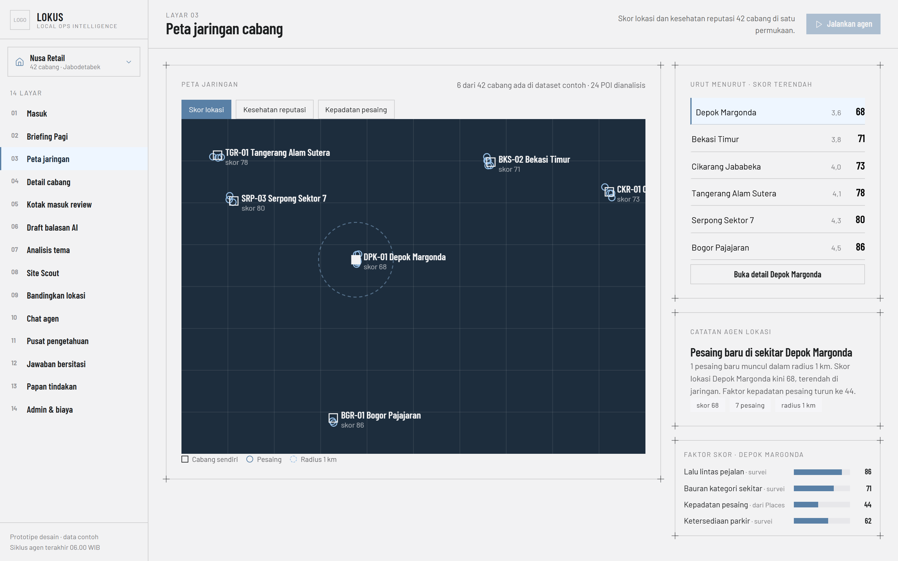
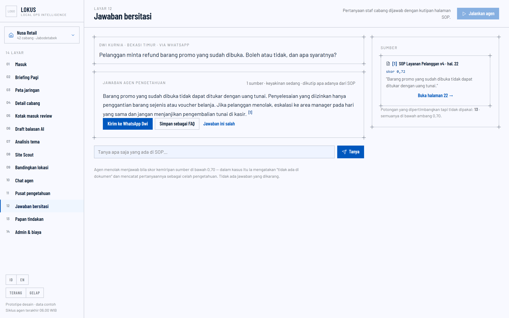
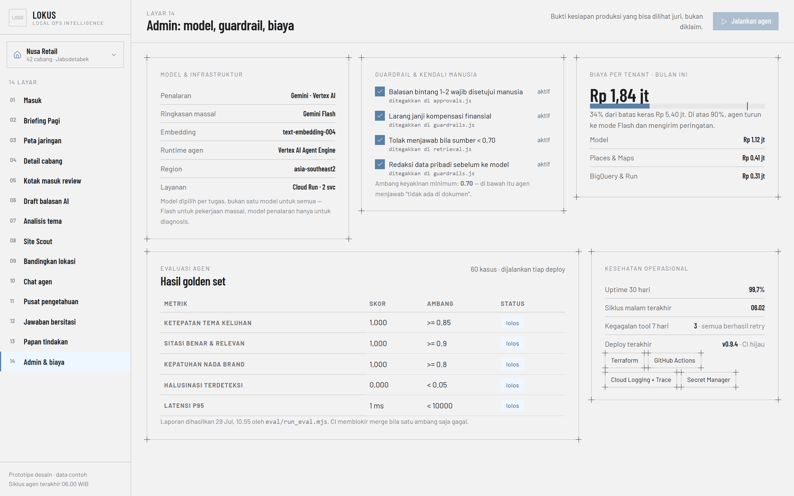
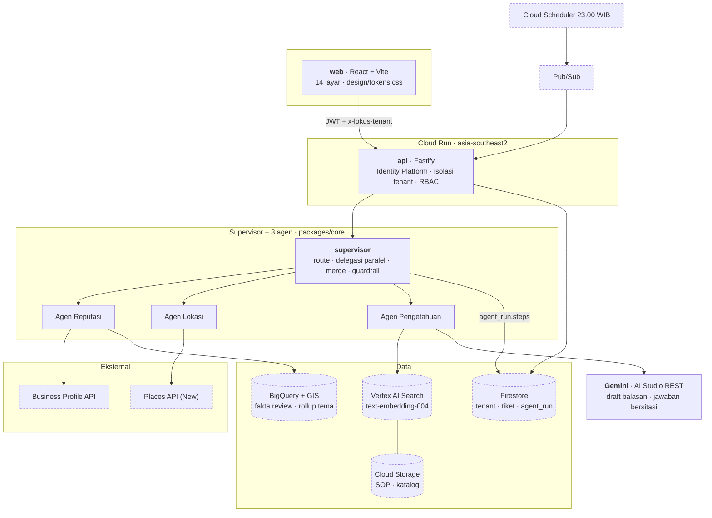

# LOKUS — Local Ops Intelligence

**Konsol intelijen operasional untuk bisnis bercabang.** Tiga agen otonom
(Reputasi, Lokasi, Pengetahuan) plus satu supervisor membaca review Google
Business Profile, data lokasi Places, dan SOP internal. Setiap pagi keluar
**Briefing Pagi** berisi maksimal tiga keputusan yang bisa diambil area manager
— masing-masing dengan buktinya, dan bisa diubah jadi tiket dalam satu klik.

Submission **EBCO AI Hackathon 2026** · Kategori A + B.

---

## Masalahnya

Bisnis bercabang di Indonesia — retail, F&B, klinik, jaringan dealer — memiliki
tiga sinyal bernilai tinggi yang tidak bisa mereka pakai:

- **Review Google menumpuk tanpa dibalas.** Median respons pertama 9 hari;
  sebagian besar tidak pernah dijawab.
- **Keputusan lokasi** (buka, pindah, tutup) diambil tanpa data kepadatan
  pesaing atau catchment.
- **Pengetahuan operasional** (SOP, aturan produk, kontrak) tersebar di PDF dan
  grup chat, sehingga staf cabang berimprovisasi dan layanan jadi tidak
  konsisten.

Akibatnya area manager bereaksi terlambat dan tidak seragam antar cabang, dan
jaringan kehilangan pelanggan tanpa tahu sebabnya.

## Dampak yang dituju

Angka baseline dan target berasal dari [`specs/001-lokus-core/spec.md`](specs/001-lokus-core/spec.md).
Kolom ketiga adalah **yang sudah benar-benar terbukti di build ini** — dipisah
dengan sengaja, karena mengklaim dampak lapangan dari sebuah demo tidak jujur.

| Metrik | Sebelum | Target | Yang sudah terbukti di repo ini |
|---|---|---|---|
| Median respons pertama ke review | 9 hari | < 8 jam | Draft dihasilkan seketika untuk 6 tema keluhan; 4/4 guardrail lolos pada 80 keluhan contoh yang diuji |
| Review dibalas dalam 48 jam | 31% | > 90% | 592 dari 713 (bintang 3–5) boleh dibalas tanpa persetujuan; **seluruh 121 review bintang 1–2 ditahan** — 95 sudah disetujui manusia bernama lalu terkirim, 26 masih menunggu di antrean |
| Tema naik terdeteksi sebelum rating turun 0,2 | tidak pernah | 7–10 hari lebih awal | Klasterisasi menemukan 36 sel matriks tema **dari teks saja**, dengan delta mingguan per cabang |
| Waktu tutup tiket | tidak diukur | < 5 hari (SLA) | Papan tindakan mengukurnya; tiket contoh yang ditutup membawa dampaknya |
| Biaya per tenant per bulan | — | < Rp 5,4 juta | Ditegakkan di kode: turun ke Flash di 90%, batas keras menolak panggilan |

**Yang belum bisa diklaim:** angka lapangan. Sistem berjalan di atas dataset
contoh 713 review — mekanismenya bekerja dan bisa diuji, dampak sesungguhnya
butuh tenant pilot (spec.md Q1).

---

## Coba sendiri dalam 60 detik

Perlu Node 20+. Tanpa akun Google Cloud, tanpa kredensial.

```bash
npm install
npm run dev        # http://localhost:5173/masuk
npm run eval       # 60 kasus golden set, 5 ambang kualitas
```

Secara bawaan konsol berjalan di atas dataset contoh **di dalam browser**.
Untuk menjalankannya lewat API sungguhan — sehingga lapisan auth, isolasi
tenant, dan RBAC benar-benar dilewati — jalankan keduanya:

```bash
# terminal 1 — API
GOOGLE_CLOUD_PROJECT=demo \
LOKUS_AUTH_MODE=dev \
LOKUS_ALLOWED_ORIGINS=http://localhost:5173 \
npm run dev --workspace @lokus/api

# terminal 2 — konsol
VITE_LOKUS_API_URL=http://localhost:8080 npm run dev
```

`LOKUS_AUTH_MODE=dev` menerima identitas tanpa verifikasi dan **hanya untuk
lokal** — server menolak start bila mode itu aktif saat `NODE_ENV=production`.

**Demo URL: https://ardianwidyo.github.io/lokus/** — hidup, keempat belas layar
bisa diklik, tanpa login dan tanpa akun apa pun. Konsol berjalan di atas
dataset contoh **di dalam browser**, jadi yang Anda lihat di sana adalah
aplikasi yang sama dengan yang dijalankan `npm run dev`.

Yang **tidak** ada di demo URL itu: lapisan API. Auth, isolasi tenant, dan RBAC
diuji oleh 127 test di workspace `api` dan bisa Anda jalankan sendiri dengan
dua perintah di bawah, tapi tidak dilewati oleh demo publik. Terraform di
[`infra/`](infra/) tervalidasi terhadap provider Google 6.12 dan **belum
teraplikasi** — deploy Cloud Run menunggu billing account yang aktif
([`docs/deploy.md`](docs/deploy.md) punya langkahnya).

**Akun demo:** tidak perlu. Layar 01 menampilkan tiga tenant contoh; pilih
**Nusa Retail** (Area Manager) untuk akses penuh, atau **Klinik Sehat Prima**
(Viewer) untuk melihat gerbang peran bekerja.

### Tiga hal yang paling layak diuji

1. **Tanya sesuatu yang tidak ada di SOP.** `/chat` → *"Bagaimana resep rendang
   padang?"* Agen menolak dan mencatat celah pengetahuan. Tidak ada yang
   dikarang.
2. **Setujui satu keputusan.** `/briefing` → **Setujui & buat tiket** → buka
   `/tindakan`. Tiketnya ada, dengan tautan balik ke keputusan yang
   melahirkannya.
3. **Lihat jejak eksekusinya.** `/chat` → *"Kenapa rating cabang Bekasi Timur
   turun bulan ini?"* Chip jejak ada di dalam jawaban, lengkap dengan tool,
   latensi, dan biaya.

---

## Empat belas layar

Semuanya ditangkap dari aplikasi yang benar-benar berjalan oleh
[`scripts/screenshots.mjs`](scripts/screenshots.mjs) — skrip itu gagal bila
satu saja layar melempar error konsol, jadi gambar-gambar di bawah sekaligus
bukti bahwa konsolnya bersih. Regenerasi: `node scripts/screenshots.mjs`.

| | | |
|---|---|---|
| **02 · Briefing Pagi**<br>[](docs/screenshots/02-briefing.png)<br>Maksimal tiga keputusan, masing-masing dengan buktinya. | **10 · Chat agen**<br>[](docs/screenshots/10-chat.png)<br>Satu pertanyaan, tiga agen, 8 langkah tool yang tampil. | **04 · Detail cabang**<br>[](docs/screenshots/04-cabang.png)<br>Garis pembukaan pesaing dari Places, bukan dari deret rating. |
| **03 · Peta jaringan**<br>[](docs/screenshots/03-peta.png)<br>Penanda berbeda bentuk, bukan berbeda warna. | **12 · Jawaban bersitasi**<br>[](docs/screenshots/12-jawaban.png)<br>Tiap klaim menempel ke halaman SOP-nya. | **14 · Admin & biaya**<br>[](docs/screenshots/14-admin.png)<br>Ambang eval, guardrail, dan batas biaya. |

Delapan sisanya ada di [`docs/screenshots/`](docs/screenshots/):
[01 masuk](docs/screenshots/01-masuk.png) ·
[05 kotak masuk review](docs/screenshots/05-review.png) ·
[06 draft balasan](docs/screenshots/06-draft.png) ·
[07 analisis tema](docs/screenshots/07-tema.png) ·
[08 Site Scout](docs/screenshots/08-site-scout.png) ·
[09 bandingkan lokasi](docs/screenshots/09-bandingkan.png) ·
[11 pusat pengetahuan](docs/screenshots/11-pengetahuan.png) ·
[13 papan tindakan](docs/screenshots/13-tindakan.png).

---

## Arsitektur



Ketiga agen berjalan. Setiap tool yang mereka panggil muncul sebagai langkah
bernomor di jejak eksekusi layar 10, dan setiap angka yang dihasilkannya
menempel pada sumber yang bisa dibuka.

### Apa yang benar-benar berjalan, dan apa yang belum

Kotak bergaris putus-putus di diagram di atas **belum tersambung**. Kami
memisahkannya secara eksplisit karena kriteria penilaian menuntut stack yang
*terpakai*, bukan disebut — dan diagram yang menggambarkan layanan yang tidak
pernah dipanggil adalah klaim yang tidak bisa dipertanggungjawabkan.

| Berjalan sungguhan | Belum tersambung |
|---|---|
| **Gemini** (`gemini-2.0-flash` / `-lite`) menulis draft balasan (layar 06) dan jawaban bersitasi (layar 12) lewat AI Studio REST — [`gemini.js`](packages/core/src/adapters/gemini.js) | **Vertex AI Agent Engine** & **Vertex AI Search**: butuh billing account aktif |
| Supervisor: routing, delegasi paralel, merge, guardrail, jejak langkah bernomor | **BigQuery + GIS**: klasterisasi, tren, dan jarak dihitung deterministik di `packages/core` |
| Retrieval berambang 0,70, penolakan, dan pencatatan celah pengetahuan | **Firestore** & **Cloud Storage**: state di memori |
| Isolasi tenant, RBAC, guardrail, batas biaya | **Business Profile** & **Places**: adapter sengaja tidak diimplementasi, bukan dipalsukan |

**Datanya sintetis.** 713 review, 6 cabang, POI pesaing, dan pasal SOP
dihasilkan generator deterministik di `packages/core/src/seed`. Tidak ada
review Google sungguhan, dan adapter Google-nya
[melempar error alih-alih mengarang](packages/core/src/adapters/gbp.js) bila
dipanggil tanpa kredensial.

**Yang membuat Gemini di sini bukan sekadar tempelan:** keluarannya diperiksa,
bukan dipercaya. Jawaban yang tidak menyebut sumber dibuang; jawaban yang
menyebut `[9]` padahal hanya ada tiga kutipan dibuang; yang sampai ke pembaca
adalah jawaban deterministik. Layar 12 menyebutkan mana yang terjadi —
*"ditulis gemini-2.0-flash, lolos cek sitasi"* atau *"dikutip apa adanya dari
SOP"*. Tanpa `GEMINI_API_KEY` seluruh sistem berjalan di jalur deterministik,
dan itulah yang dilayani demo publik, karena key di dalam bundel browser adalah
key yang bocor.

---

## Empat aturan yang mengikat seluruh kode

Dari [`.specify/memory/constitution.md`](.specify/memory/constitution.md).
Setiap klaim di bawah bisa Anda periksa di file yang disebut.

**Bersumber atau diam.** Setiap klaim AI menempel pada id review atau halaman
SOP. Di bawah keyakinan 0,70 agen menjawab "tidak ada di dokumen" dan mencatat
celah pengetahuan. Supervisor menolak secara **mekanis** — ia tidak menilai
apakah jawaban terdengar benar, ia memeriksa apakah array `sources` kosong
([`supervisor.js`](packages/core/src/agents/supervisor.js)). Ada test yang
memberinya temuan meyakinkan tanpa sitasi dan memastikan kalimat itu tidak
lolos ke jawaban.

**Manusia memegang suara publik.** Balasan review bintang 1–2 tidak terkirim
sebelum manusia bernama menyetujuinya, dan penyetuju + waktunya tercatat
sebelum apa pun dikirim. Ditegakkan di **tiga lapis terpisah** —
[`approvals.js`](packages/core/src/reputation/approvals.js),
[`gbp.js`](packages/core/src/adapters/gbp.js), dan gerbang peran API — supaya
satu lapis gagal pun jaminannya utuh.

**Multi-tenant sejak awal.** Tenant id ada di setiap query, dokumen, dan baris
log. Tenant yang tidak diberikan token menghasilkan penolakan yang **identik**
dengan tenant yang tidak ada, jadi endpoint-nya tidak bisa dipakai menebak.
Penjaganya [`tenantScope.js`](packages/core/src/lib/tenantScope.js): query tanpa
tenant id melempar error, bukan mengembalikan baris.

**Empat state di setiap panel data.** Memuat, kosong, gagal, perlu izin. Bukan
tambalan — [`DataPanel`](web/src/components/states/DataPanel.jsx) membuatnya
struktural, dan [audit T055](web/test/fourStates.test.jsx) menegakkannya sebagai
test sehingga layar baru yang lupa satu state akan menggagalkan build.

---

## Bukti kesiapan produksi

| Bukti | Di mana |
|---|---|
| **886 test** lulus di 4 workspace | `npm test` |
| **24 dari 24 acceptance criteria** di spec.md punya test yang menyebutnya per nama | `grep -r AC- */test eval` |
| **Eval agen**: 60 kasus, 5 ambang konstitusi, CI memblokir merge bila satu gagal | [`eval/`](eval/) · `npm run eval` |
| **Terraform**: Cloud Run, Firestore, BigQuery, Storage, Secret Manager, Scheduler, WIF | [`infra/`](infra/) |
| **CI**: lint, test + ambang cakupan, `terraform validate`, gerbang secret, eval | [`ci.yml`](.github/workflows/ci.yml) |
| **CD**: dua image, auth tanpa kunci (WIF), rollout hanya setelah CI hijau | [`deploy.yml`](.github/workflows/deploy.yml) · [`docs/deploy.md`](docs/deploy.md) |
| **Batas biaya**: turun ke Flash di 90%, alert, batas keras menolak | [`budget.js`](packages/core/src/cost/budget.js) |
| **14/14 layar hidup di demo URL**, diverifikasi lewat browser sungguhan | [`scripts/screenshots.mjs`](scripts/screenshots.mjs) |
| **Aksesibilitas**: struktur, keyboard, kontras palet dihitung | [`accessibility.test.jsx`](web/test/accessibility.test.jsx) |

Kualitas jejak audit yang paling layak diperiksa: **klasterisasi tema
menemukan kembali seluruh 36 sel matriks layar 07 dari teks Bahasa Indonesia
saja.** Generator menyusun dataset dari matriks itu; klasterisasi tidak pernah
melihat rencananya, dan tidak ada satu pun baris review yang membawa label tema
([test-nya](packages/core/test/themeCluster.test.js)).

---

## Spec-Driven Development

Spec ditulis dan di-commit **sebelum** kodenya, setiap kali. Empat pasangan
yang bisa ditelusuri:

| Spec | Kode yang mengikutinya |
|---|---|
| [`d53509c`](https://github.com/ardianwidyo/lokus/commit/d53509c) constitution, spec, plan, tasks | [`4fd5517`](https://github.com/ardianwidyo/lokus/commit/4fd5517) T001 Terraform baseline |
| [`3a8d580`](https://github.com/ardianwidyo/lokus/commit/3a8d580) `packages/core` + mode auth lokal | [`a30f3ec`](https://github.com/ardianwidyo/lokus/commit/a30f3ec) T010 adapter + dataset |
| [`3cecc5f`](https://github.com/ardianwidyo/lokus/commit/3cecc5f) runner eval Node, bukan Python | [`420bf45`](https://github.com/ardianwidyo/lokus/commit/420bf45) T050 golden set |
| [`1eaf36d`](https://github.com/ardianwidyo/lokus/commit/1eaf36d) T057 pipeline deploy | [`5256bc4`](https://github.com/ardianwidyo/lokus/commit/5256bc4) T057 implementasi |
| [`7acf6c7`](https://github.com/ardianwidyo/lokus/commit/7acf6c7) T034 apa yang tidak boleh digambar layar 04 | [`T034`](specs/001-lokus-core/tasks.md) implementasi layar 04 |

Setiap penyimpangan dari rencana dicatat di
[`plan.md`](specs/001-lokus-core/plan.md) bagian *Recorded deviations*, dengan
alasan dan tanggalnya — termasuk keputusan menulis runner eval dalam Node
padahal `tasks.md` menyebut Python.

Satu tugas = satu commit dengan prefix id-nya. 46 tugas sudah ter-commit.

---

## Tema bonus yang diklaim

| Tema | Bukti di repo |
|---|---|
| **Agen otonom + tool calling** | [`packages/core/src/agents/`](packages/core/src/agents/) — supervisor dengan routing intent, delegasi paralel, merge, dan penolakan saat `sources` kosong |
| **RAG bersitasi** | [`packages/core/src/knowledge/`](packages/core/src/knowledge/) — retrieval dengan ambang 0,70, sitasi tingkat halaman, hitungan potongan yang ditolak |
| **Jejak eksekusi terlihat di UI** | [`web/src/screens/ChatScreen.jsx`](web/src/screens/ChatScreen.jsx) + [`GET /v1/runs/:id`](api/src/routes/runs.js) — jejak di dalam jawaban, bukan di balik tombol |
| **Analitik + GIS** | [`infra/bigquery_tables.tf`](infra/bigquery_tables.tf), [`infra/sql/`](infra/sql/) — tabel fakta berpartisi, rollup tema, dimensi outlet bergeografi |

---

## Struktur

```
packages/core   logika domain: supervisor, tema, guardrail, draft, tiket, biaya
api             Cloud Run + Fastify: Identity Platform, isolasi tenant, RBAC
web             React + Vite: 14 layar di atas design/tokens.css
eval            golden set + runner yang menggerbangi deploy
infra           Terraform: Cloud Run ×2, Firestore, BigQuery, Storage, Secret Manager, WIF
specs           spec, plan, tasks — ditulis sebelum kodenya
design          tokens.css, UI-GUIDELINES.md, SCREENS.md
docs            deploy.md, demo-script.md
```

## Status build

Fase **P0** (fondasi), **P1** (reputasi), **P2** (pengetahuan), **P3** (lokasi),
**P4** (orkestrasi), dan **P5** (pengerasan) selesai. **Keempat belas layar
berjalan** — tidak ada lagi placeholder. Rincian per tugas di
[`specs/001-lokus-core/tasks.md`](specs/001-lokus-core/tasks.md).

## Catatan tentang angka

Angka di layar **dihitung dari dataset**, bukan disalin dari mockup. Di
beberapa tempat hasilnya berbeda tipis dari angka ilustratif di
`design/SCREENS.md` — yang dihitung yang dipakai, karena konstitusi menuntut
setiap angka bisa ditelusuri ke baris yang menghasilkannya.

**"42 cabang" di rail vs 6 di peta.** Keduanya benar dan artinya berbeda: 42
adalah ukuran jaringan Nusa Retail seperti tercatat di direktori tenant, 6
adalah cabang yang benar-benar tercakup dataset contoh 713 review. Panel peta
mengatakannya sendiri — *"6 dari 42 cabang ada di dataset contoh"* — supaya
tidak ada yang perlu menebak angka mana yang sedang dilihat.

Dua tempat lain di mana ini terlihat jelas, keduanya di layar 04:

- Grafiknya menggambar **8 pekan**, bukan 12 seperti label di mockup, karena
  8 pekan adalah seluruh rentang review yang ada. Empat pekan tambahan pada
  grafik penurunan tidak akan bisa dibedakan dari data asli oleh pembacanya.
- Garis putus-putus "28 Jun · pesaing baru buka" digambar dari respons Places,
  bukan dari deret ratingnya. Di dataset ini pembukaan itu ada di **Depok
  Margonda**, bukan Bekasi Timur; cabang tanpa pembukaan tercatat tidak
  mendapat garis dan mengatakannya. Layar melaporkan rating bergerak berapa di
  pekan yang sama, lalu berhenti di situ — sebabnya belum diuji.

## Tim

Belum diisi — spec.md Q3 masih terbuka.
